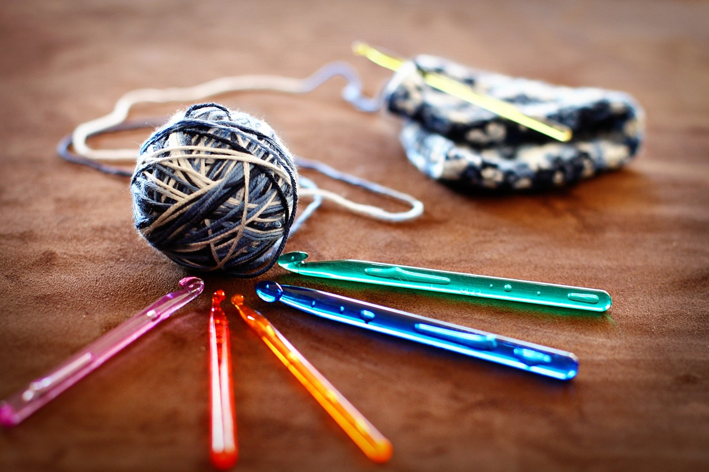

# My First Coding Assignment

## About Me

    My name is Sanya Safi, and I am a novice coder but I am very excited to learn more about it. I am also an aspiring small business co-owner of a crochet business called Loop to Loop.

## Past Coding Experience

    I have taken a web development certificate through my community college and that is when I knew I wanted to get into Web Desgin and Development. Then watched vidoes on SQL and related softwares, though it has been a while since I have looked at it again.

## Career Goals

    My career goal is in two sections. The first, I want to be able to get a job in web design and development, with more of a UI/UX focus. I also would like to make my crochet business into something substantial as well, maybe someday just focusing on it.
